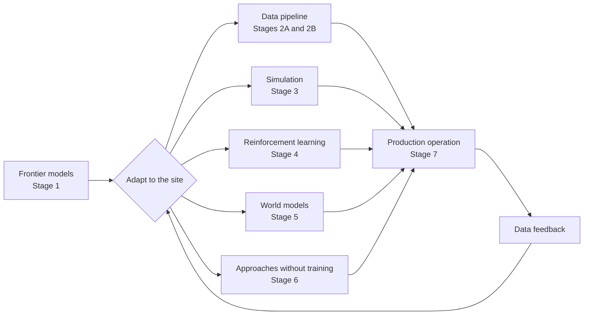
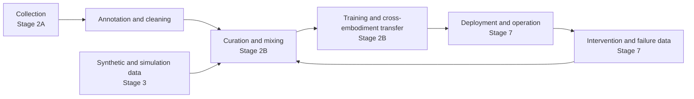

# A Deployer's Frontier Reading Plan (About One Month)

**English** | [简体中文](README.zh-CN.md)

> Published snapshot: October 8, 2026. The Chinese original is maintained in the author’s private vault. This repository provides shareable Chinese and English editions. Reading checkmarks and dates retain the original plan’s state; the English translation is dated October 6 with an October 8 addendum.

Sep 24, 2026 · @Jetson Wu

October 2, 2026 update: Added frontier-model material from Sunday, Skild, Generalist, Dyna, Rhoda, and Genesis, along with Dyna's deployment retrospective. Dates in the stage headings retain the original schedule for reference. The additions bring about 12.5 hours of main-track reading; revised completion estimates are at the end.

October 8, 2026 addendum: Added What Can RL Bring to VLA Generalization? to Stage 4 as a 2-hour close read, matching the addition to the Chinese canonical plan. The rest of this translation remains the October 6 snapshot. This entry and reading guidance were generated by Codex (author: ai; owner_endorsement: unconfirmed), based on [paper v2](https://arxiv.org/html/2505.19789v2) and the [authors’ project page](https://rlvla.github.io/), checked on October 8, 2026. Completion dates below remain rough estimates; this addition adds about 0.4–0.5 reading days.

## Overview

This plan takes about a month: the original schedule ran from September 25 to October 25 at roughly five hours a day. With the October 2 additions, the rough completion date moves to October 28; see the estimates at the end. The plan is organized around the decisions a deployer needs to make: given a frontier model and a customer site, what options do you have at each step to get it working reliably and improving over time? RL is one of those options, not the presumed answer.

Seven areas each get a stage, with the data pipeline split into 2A and 2B: frontier models themselves, the data pipeline, simulation, reinforcement learning, world models, approaches without training, and the runtime after deployment. For each, read the strongest case for it and the strongest objections. In Stage 8, apply them to the real scenarios you are working on.

Stage 0 establishes the framework; Stage 8 produces a decision map. Put every approach through the same questions: how much data, real-robot time, compute, and human effort does it require? Where does it most often fail? What is the strongest argument against it?

Daily rhythm: no more than one deep read a day, during your sharpest two or three hours. Use the rest of the time for close reads, quick reads, or stage deliverables. Leave a consolidation day after every two stages (October 5, 12, and 19): no new papers, just catching up on notes and answering review questions. There is also a broader-perspectives track for 15–20 minutes before bed. If time is tight, cut quick reads first, not derivations or deliverables.

What counts as finished: for each approach, you can explain which deployment scenarios it suits best, its order-of-magnitude costs, typical failures, and strongest objections. The decision map is complete.

## The Deep-Reading Protocol

The three reading levels differ in both time and expected output. A deep read means you can derive it, explain it, and use it.

| Level | Time per piece | How to read | What you should have afterward |
| --- | --- | --- | --- |
| Deep read | 4–5 hours | Three passes: first read the abstract, figures, and conclusion, then write down what you expect the method to be. Next, work through the method section by section and derive the key equations by hand. Finally, tie each claim to a specific table or figure. If code is available, check the few dozen lines that implement the core loss. | One page of notes, plus passing the review questions |
| Close read | 2–3 hours | Read the methods and experiments in full; hand derivations are not required. | Explain in your own words what changed from prior work and why it works |
| Quick read | 0.5–1.5 hours | Abstract, introduction, figures, and conclusion | Understand the claim and its limits |

Deep-reading notes always have five parts:

1. The insight in one sentence, without copying the abstract.
2. The core equations and what each term means.
3. What changed from prior work.
4. One strongest and one weakest piece of evidence.
5. How you would use it in a real deployment, such as Lianbang's insertion and removal task, and how much data, real-robot time, compute, and human effort it would take.

To check your understanding, send your notes to Claude after each deep read and ask for three to five questions, as you did when reading RL-100 in depth. If you cannot answer them, return to the second pass. The places where you get stuck in a derivation are often exactly where your understanding breaks down.

## Broader Perspectives

Spend 15–20 minutes on a piece before bed each day. This track takes about 9.5 hours in total, separate from the stage allocations. Stage 0 already includes Goldberg, Brooks, Sporks, and two PI posts; Stage 1 includes TRI's evaluation. These readings complement them.

The three anchor pieces you have already read, a16z's The Physical AI Deployment Gap, Not Boring's Robot Steps, and TechCrunch's interview with RJ Scaringe, do not get additional time here. Several readings below are the original sources those pieces cite or argue against, so refer back to them as you read.

| Done | Order | Reading | Pair with | Questions to keep in mind |
| --- | --- | --- | --- | --- |
| ☑ | 1 | [The Bitter Lesson](http://www.incompleteideas.net/IncIdeas/BitterLesson.html) (Sutton, 2019) | Stage 0 | Read alongside Goldberg and Robot Steps: what conditions must hold for general methods plus compute to win in robotics, and where will the data come from? |
| ☑ | 2 | ["Data will solve robotics and automation: True or false?": A debate](https://autolab.berkeley.edu/assets/publications/media/Data-Debate-Science-Robotics-Aug-2025-scirobotics.aea7897.pdf) (Science Robotics, August 2025; Tedrake, Rus, Billard, Goldberg, et al.) | Stage 0 | What is each academic camp's strongest argument? Which side do you take, and why? |
| ☐ | 3 | [Debate: Will Humanoids Replace Most Human Workers?](https://www.science.org/doi/full/10.1126/scirobotics.aeh6422) (Science Robotics, May 2026; researchers and practitioners from China and abroad) | Stage 1 | Where do their estimates of the pace of humanoid labor replacement diverge? |
| ☑ | 4 | [Elon Dreams and Bitter Lessons](https://stratechery.com/2024/elon-dreams-and-bitter-lessons/) (Ben Thompson, Stratechery, 2024) | Stage 2A | Tesla and Waymo's two data strategies. Does the idea that you need distribution before you can benefit from the Bitter Lesson hold for robotics? |
| ☐ | 5 | [Learning by Watching Human Videos](https://www.skild.ai/blogs/learning-by-watching) (Skild AI) | Stage 2A | The strongest public case for human video. Read it against the criticism in Robot Steps. |
| ☐ | 6 | Software 2.0 (Karpathy, 2017; [karpathy.medium.com](https://karpathy.medium.com)) | Stage 2B | When the dataset is the source code, what engineering discipline should govern the data pipeline: versioning, debugging, regression testing? |
| ☐ | 7 | [Demonstrably Safe AI for Autonomous Driving](https://waymo.com/blog/2025/12/demonstrably-safe-ai-for-autonomous-driving) (Waymo, December 2025) | Stage 2B | What does the most mature deployment data flywheel look like? Which parts transfer directly to robotics? |
| ☐ | 8 | [Robust Autonomy Emerges from Self-Play](https://machinelearning.apple.com/research/robust-autonomy-emerges) (Apple) | Stage 3 | Why do driving policies trained entirely through self-play in simulation generalize? What is missing if you try to bring this to manipulation? |
| ☐ | 9 | Understanding the World Through Action (Levine, 2021) | Stage 4 | Why does he see self-supervision plus offline RL as the path to general intelligence? |
| ☐ | 10 | The Dark Matter of Robotics: Physical Commonsense ([Generalist blog](https://generalistai.com/blog)) | Stage 5 | What evidence supports the claim that physical commonsense emerges with scale? |
| ☐ | 11 | Fully autonomous robots are much closer than you think (Dwarkesh Podcast interview with Levine, September 2025, about 90 minutes) | Stage 7 | How, exactly, does his self-improvement flywheel work? Why does he think the bottleneck is operations rather than algorithms? |
| ☐ | 12 | [Toward a General-Purpose Robotics Platform](https://a16z.com/toward-a-general-purpose-robotics-platform/) (a16z) | Stage 8 | What does the debate between platforms and vertical integration mean for DimOS's positioning? |
| ☑ | 13 | [The Final Offshoring](https://finaloffshoring.com/) (Jacob Rintamaki) | Stage 8 | The economics of quickly and cheaply teaching a robot to do one thing well. |
| ☐ | 14 | Rodney Brooks's Predictions Scorecard, updated every January 1 ([rodneybrooks.com](https://rodneybrooks.com)) | Stage 8 | Use his prediction record over the past few years to calibrate your own expectations for the industry's pace. |
| ☐ | 15 | [The Hidden Pillar of Robotics](https://www.skild.ai/blogs/skild-crosses-100m-arr) (Deepak Pathak and Abhinav Gupta, Skild AI, September 2026) | Stage 7 | The worldview of a company that puts deployment first: cycle time matters as much as accuracy; sites keep changing, hence the bet on single-video in-context learning instead of repeated post-training; why demo culture and deployment culture are incompatible; and the data flywheel in which specialist deployments feed the generalist. Their wire-harness manufacturing project offers a direct comparison with Lianbang's harness testing. This is a company article, so check its conclusions against Sirius and the Levine interview. |
| ☐ | 16 | [Will Scaling Solve Robotics?](https://spectrum.ieee.org/solve-robotics) (Nishanth Kumar, IEEE Spectrum, 2024) | Stage 0 | A balanced overview of the CoRL 2023 debate on whether scaling can solve robotics: the arguments for it (precedents in CV/NLP, the Bitter Lesson, commonsense) and against it (lack of data, different embodiments, the long tail beyond 99.X% success, errors compounding over long horizons, and the lessons of autonomous driving), plus the middle ground of human-in-the-loop systems and classical methods combined with learning. Treat it as a prequel to the Science Robotics debate in item 2. Ask which concerns have been addressed by 2026 results such as π0.7 and Dream Machines, and which remain open. |
| ☐ | 17 | [What 10 Months in Production Taught Us About the Robotics “Bubble”](https://www.dyna.co/news/robotics-bubble) (York Yang, Dyna, May 2026; quick read, 0.5 hours) | Stages 0 / 7 / 8 | How does field engineering become capability you can reuse in the next deployment? The company reports that delivery still takes weeks to months and that reuse has been difficult; this cannot be generalized directly to the whole industry. Compare with PI's partner model and Skild's deployment flywheel to test whether vertical integration is necessary. In Stage 8, measure progress through deployment labor hours, intervention rates, and maintenance costs for comparable tasks. |

## Stage 0 (Sep 25): Establish the Framework

The question for this stage: what are the main schools of thought in the field today, and what is each betting on? About 5 hours, all quick reads.

| Done | Level | Reading | Time | What to focus on |
| --- | --- | --- | --- | --- |
| ☑ | Quick read | [The Physical Intelligence Layer](https://www.pi.website/blog/partner) (PI) | 1 hour | How do deployers such as Weave and Ultra actually use foundation models? How much improvement comes from putting their data into pretraining? Where do deployers earn their money in the value chain? |
| ☑ | Quick read | [Moravec's Paradox and the Robot Olympics](https://www.pi.website/blog/olympics) (PI) | 0.5 hours | Which difficult tasks become possible by fine-tuning frontier models, and how much data does it take? |
| ☑ | Quick read | [Good old-fashioned engineering can close the 100,000-year data gap in robotics](https://autolab.berkeley.edu/assets/publications/media/GOFE-Can-Close-the-100000-Year-Robot-Data-Gap-Science-Robotics-Aug-2025-scirobotics.aea7390.pdf) (Goldberg, Science Robotics) | 0.5 hours | What approaches does he list for closing the data gap? How does the one he favors relate to deployers? |
| ☑ | Quick read | [Sporks of AGI](https://sergeylevine.substack.com/p/sporks-of-agi) (Levine) | 1 hour | Why can proxy data from simulation, human video, and handheld grippers fall short? Find one argument you disagree with. |
| ☐ | Quick read | [Why Today's Humanoids Won't Learn Dexterity](https://rodneybrooks.com/why-todays-humanoids-wont-learn-dexterity/) (Brooks) | 1.5 hours | Focus on the argument about touch and force control. What does it imply for vision-only VLAs? |
|  |  |  |  |  |

Stage deliverable (0.5 hours): Rank the five adaptation approaches, data and imitation, simulation, reinforcement learning, world models, and approaches without training, by your current intuition. Write one sentence explaining each choice. Revisit this ranking in Stage 8.

## Stage 1 (Sep 26–28): What Frontier Models Can Do Out of the Box

The question for this stage: what can off-the-shelf frontier models do today, and where do they fail? About 19 hours, originally scheduled for 3 days. The added material requires extending the schedule.

| Done | Level | Reading | Time | What to focus on |
| --- | --- | --- | --- | --- |
| ☐ | Quick read | Compare frontier-model approaches: Sunday ACT-2, Skild S1, GEN-1.5, Dyna-2 / 2.1, Rhoda DVA, and Genesis GENE-26.5 (links in their respective stages) | 2 hours | Start with tasks, inputs, adaptation methods, and evaluation limits, and fill in the shared comparison table. Read the methods and experiments in the later stages; do not duplicate the close reading here. |
| ☐ | Close read | [ACT-2 Preview: Generalizing Reliability](https://www.sunday.ai/blog/act-2-preview) (Sunday) | 1.5 hours | How does pretraining narrow the generalization gap between internal environments and unfamiliar homes? Distinguish the single-demonstration experiment, which used SFT, from the unfamiliar-home evaluation, which used no per-home adaptation. Check the task scope, number of attempts, folding quality, and definition of failure behind the 99.1% figure. Connect to Stage 4. |
| ☐ | Deep read | [π0.5](https://arxiv.org/abs/2504.16054) (PI, 2025) | 4 hours | How is open-world generalization measured? What do multi-robot data, web data, and high-level subtask annotations each contribute? How does it fail in homes it has never seen? |
| ☐ | Close read | [π0.7](https://www.pi.website/blog/pi07) (PI, April 2026) | 3 hours | What does steerability mean in concrete terms: metadata, control modes, subgoal images? What actually transfers in zero-shot cross-embodiment transfer? Why does language guidance raise success rates? |
| ☐ | Close read | [Gemini Robotics 1.5](https://arxiv.org/abs/2510.03342) (Google DeepMind, 2025) | 2.5 hours | How much does embodied reasoning before acting help with long tasks? How is cross-embodiment action transfer done, and how much does it help? |
| ☐ | Close read | [GR00T N1](https://arxiv.org/abs/2503.14734) (NVIDIA, 2025) | 2 hours | What proportions of the data come from real robots, simulation, and human video, and what does each contribute? Why use a fast-and-slow dual system? |
| ☐ | Close read | [A Careful Examination of Large Behavior Models for Multitask Dexterous Manipulation](https://arxiv.org/abs/2507.05331) (TRI, 2025) | 2.5 hours | How are blind evaluations and statistical tests conducted? How much data does multitask pretraining save on new tasks? Under what conditions does pretraining not help? |
| ☐ | Quick read | Galaxea's [G0 technical report](https://github.com/OpenGalaxea/G0) and [G0.5](https://opengalaxea.github.io/G05/) | 1 hour | The experiments showing diminishing benefits from cross-embodiment pretraining when embodiments differ substantially. For the OEM you are responsible for, where are the model's limits? |

Stage deliverable (0.5 hours): Make a table mapping these models to the tasks you care about, insertion and removal, retail price-tag scanning, and store operations. State what each can do out of the box, what is missing, and what failure looks like.

Use the same comparison table for every frontier model: record the demonstration or instruction input, whether weights are updated, on-site data requirements and adaptation time, the range of variation tested, success rate and cycle time, and whether deployers can actually access it. Mark undisclosed items as such. Record company-run tests, demo videos, and independent validation separately. Success rates on different tasks cannot be ranked directly. Read Skild S1 and GEN-1.5 together in Stage 6; Dyna-2 and Genesis in Stage 2A; Rhoda in Stage 5; and Dyna-2.1 in Stage 7.

## Stage 2A (Sep 29–Oct 1): Data Collection and Scaling Laws

The question for this stage: how much data, money, and time does it take to adapt a model to a new site through data collection and fine-tuning? About 19.5 hours, originally scheduled for 3 days. The added material requires extending the schedule.

| Done | Level | Reading | Time | What to focus on |
| --- | --- | --- | --- | --- |
| ☐ | Close read | [Dyna-2: A 1-Million-Hour Scaling Law for World-Action Models](https://www.dyna.co/dyna-2) (Dyna) | 2 hours | What do video prediction, human action data, and pretraining scale each contribute? Do the gains from scale hold up on real-robot tasks after post-training? Distinguish validation-set proxy metrics from actual success rates. Connect to Stage 5. |
| ☐ | Quick read | Genesis AI / GENE-26.5: [company announcement](https://www.prnewswire.com/news-releases/genesis-ai-unveils-gene-26-5--the-first-ai-brain-to-enable-robots-with-human-level-physical-manipulation-capabilities-302763638.html), [official technical blog](https://www.genesis.ai/blog) | 0.5 hours | Designing around the human hand, data-collection gloves, robot hands, and simulation together: which data-transfer difficulties does this reduce, and what hardware requirements does it tie you to? Connect to Stage 3. As of October 2, 2026, the technical article on the official site could not be read, so the company announcement is included provisionally. Record demonstrated capabilities, evaluations, and access separately; do not treat promotional claims as validated results. |
| ☐ | Deep read | [UMI](https://arxiv.org/abs/2402.10329) (Chi et al., Shuran Song's group, RSS 2024) | 4 hours | Why do policy-interface choices such as latency alignment and relative-trajectory actions matter more than the gripper itself? What is lost when data collected without a robot is transferred to a robot? |
| ☐ | Deep read | [Data Scaling Laws in Imitation Learning for Robotic Manipulation](https://arxiv.org/abs/2410.18647) (Lin et al., Yang Gao's group, ICLR 2025) | 4 hours | How does generalization improve with the number of environments and objects? When do additional demonstrations within one environment stop helping? Can its efficient collection strategy be applied directly at a new site? |
| ☐ | Quick read | [The Curse of Precision: A Data Scaling Law for High-Precision Robotic Manipulation](https://arxiv.org/abs/2607.23108) (2026) | 1 hour | How do data requirements rise as precision requirements tighten? Apply this to the tolerances of the insertion and removal task. |
| ☐ | Deep read | [Empirical results fine-tuning π0.5 on a real manufacturing task](https://dream-machines.eu/blog/pi05-fine-tuning) (Dream Machines, September 2026) | 3.5 hours | The piece in this list that reads most like a deployer's own field notes: fine-tuning π0.5 for an insertion task on a real production line. Why are scene diversity and data quality worth more than data volume? How did 240 trial runs with human intervention take a policy trained on one hour of data from 28% to 88%? Why did changing only RTC inference settings raise success from 76% to 93%? Why are 40 evaluation trials insufficient to distinguish small differences? Why is LoRA not enough? |
| ☐ | Quick read | [Knowledge Insulating VLA Models](https://arxiv.org/abs/2505.23705) (PI, 2025) | 1.5 hours | How do you fine-tune for a site without damaging the model's existing language understanding and generalization? |
| ☐ | Quick read | [GEN-0](https://generalistai.com/blog/nov-04-2025-GEN-0) (Generalist blog) | 1 hour | Their claimed data scaling law: where does the data come from, how is it collected, and how much is collected each week? |
| ☐ | Quick read | [In-the-Wild Compliant Manipulation with UMI-FT](https://arxiv.org/abs/2601.09988) (2026) | 0.5 hours | How much does adding force signals to handheld data collection help with contact tasks such as insertion and removal? |
| ☐ | Quick read | [Emergence of Human to Robot Transfer in VLAs](https://www.pi.website/research/human_to_robot) (PI) | 0.5 hours | At what scale does human video data start to help? |

Stage deliverable (1 hour): Write a data plan for Lianbang's insertion and removal task: how to collect it (teleoperation, UMI, human video), how much to collect, how much money and how many days it will take, and the reasoning behind those estimates.

## Stage 2B (Oct 2–4): The Data Pipeline: Curation, Mixing, Cross-Embodiment Transfer, and Operations

The question for this stage: how do you make every step from collection to use count? Which data is worth keeping, how should it be mixed, what transfers across embodiments, and how do you run collection at scale? About 16 hours over 3 days.

Stage 2A covers collection; this stage covers the three steps in the middle. Stage 3 adds synthetic data, Stage 7 covers feedback from deployment, and Stage 5 covers data generation with world models.

| Done | Level | Reading | Time | What to focus on |
| --- | --- | --- | --- | --- |
| ☐ | Deep read | [Data Analogies Enable Efficient Cross-Embodiment Transfer](https://arxiv.org/abs/2603.06450) (Yang, Finn, Sadigh, 2026) | 4 hours | What kinds of data actually transfer across embodiments? How are data analogies constructed? How does this fit with DimOS's hardware-agnostic narrative and the contrary findings in Galaxea G0? |
| ☐ | Close read | [Open X-Embodiment](https://arxiv.org/abs/2310.08864) (2023; both are coauthors) | 2 hours | When training across embodiments, where does positive transfer occur, and where does negative transfer occur? How are formats and action spaces unified? |
| ☐ | Close read | [DROID](https://arxiv.org/abs/2403.12945) (2024; both are coauthors) | 2 hours | With collection distributed across more than a dozen institutions, how are hardware, procedures, quality checks, and annotation standardized? What drives the cost per hour of usable data? |
| ☐ | Close read | [AgiBot World Colosseo](https://arxiv.org/abs/2503.06669) (AgiBot, 2025) | 2 hours | How does data-factory collection operate: facilities, collectors, quality checks, and annotation? What does it gain and give up compared with DROID's distributed, in-the-wild approach? |
| ☐ | Close read | [Re-Mix](https://arxiv.org/abs/2408.14037) (Hejna et al., Sadigh's group, CoRL 2024) | 1.5 hours | How should subsets of a large dataset be mixed? How much does the optimized mixture improve on uniform and manually chosen mixtures? Why can it match performance using only a quarter of the data? |
| ☐ | Quick read | [Data Quality in Imitation Learning](https://arxiv.org/abs/2306.02437) (Belkhale, Cui, Sadigh, 2023) | 1 hour | What does demonstration quality actually mean? Which metrics should you focus on when training data collectors? |
| ☐ | Quick read | [Robot Data Curation with Mutual Information Estimators](https://arxiv.org/abs/2502.08623) (2025) | 1 hour | How can you score each demonstration's quality without running a real robot? |
| ☐ | Quick read | [Curating Demonstrations using Online Experience](https://arxiv.org/abs/2503.03707) (Finn's group, RSS 2025) | 0.5 hours | Using the results of a small number of trial runs to select demonstrations. |
| ☐ | Quick read | [Guiding Data Collection via Factored Scaling Curves](https://arxiv.org/abs/2505.07728) (2025) | 1 hour | Which factor should the next batch of data expand: objects, scenes, lighting, or placement? |

Stage deliverable (1 hour): Draw your team's own data-pipeline diagram; adapting the one above is fine. For each step, specify who does it, which tools they use, the cost per hour of usable data, and the most likely bottleneck. Then identify which data is worth accumulating over time because it can be reused across embodiments and customers.

## Stage 3 (Oct 6–8): Simulation and Real-to-Sim

The question for this stage: how much real-robot data can simulation save you, and where will the gap become a bottleneck? About 15 hours over 3 days.

| Done | Level | Reading | Time | What to focus on |
| --- | --- | --- | --- | --- |
| ☐ | Deep read | [IndustReal](https://arxiv.org/abs/2305.17110) (NVIDIA, RSS 2023) | 4 hours | When insertion is learned with RL in simulation, which algorithms and engineering techniques bridge the gap to real hardware? What are the real-robot success rates? How much work does it take to build a simulation for a new part? |
| ☐ | Deep read | [RialTo](https://arxiv.org/abs/2403.03949) (Torne, Gupta, Agrawal, et al., RSS 2024) | 4 hours | How much manual effort does it take to turn a scan of a real scene into a digital twin? How much more robust does an imitation policy become after RL training in that twin? Which kinds of scenes cannot be reconstructed? |
| ☐ | Close read | [MimicGen](https://arxiv.org/abs/2310.17596) (NVIDIA, CoRL 2023) | 2 hours | What assumption lets roughly 200 human demonstrations expand into 50,000? Does it hold for insertion and removal? |
| ☐ | Close read | [GraspVLA](https://arxiv.org/abs/2505.03233) (Galbot and He Wang's group at Peking University, CoRL 2025) | 2 hours | How well does pretraining entirely on synthetic data transfer directly to real robots? Why start with grasping? |
| ☐ | Quick read | [SIMPLER](https://arxiv.org/abs/2405.05941) (CoRL 2024; both are coauthors) and [PolaRiS](https://arxiv.org/abs/2512.16881) (Finn's group) | 1.5 hours | Is simulation more dependable for evaluation than for training? How strongly do simulation scores correlate with real-robot scores? |
| ☐ | Quick read | Reread the simulation section of [Sporks of AGI](https://sergeylevine.substack.com/p/sporks-of-agi) | 0.5 hours | After reading the papers above, which parts of his criticism hold up, and which do not? |

Stage deliverable (1 hour): Assess the simulation route for Lianbang's insertion and removal task: what needs to be built (part models, contact parameters, cameras), how many person-months it would take, and the most likely sim-to-real bottlenecks. Compare its cost with the data plan from Stage 2A.

## Stage 4 (Oct 9–11): Reinforcement Learning

The question for this stage: under what conditions is RL worth using, and what does it gain and cost beyond imitation learning? About 19.5 hours, or roughly 4 days at 5 hours per day, slightly heavier than the other stages. You favor RL, so this stage deliberately puts its costs alongside its benefits.

| Done | Level | Reading | Time | What to focus on |
| --- | --- | --- | --- | --- |
| ☐ | Quick read | [Towards Universal Post-Training for Robotics](https://pd-perry.github.io/posts/post-training.html) (Perry Dong, Finn, September 2026) and the accompanying [EXPO tuning notes](https://pd-perry.github.io/posts/expo-tuning.html) | 1.5 hours | Read this first as a map of the stage: why is robotics RL different from RL for LLMs? What are the main categories of existing methods, and where does each get stuck? Of the five gaps in protocols, rewards, resets, human involvement, tuning, and initialization, which hurt most in your deployments? |
| ☐ | Close read | [What Can RL Bring to VLA Generalization? An Empirical Study](https://arxiv.org/abs/2505.19789) (Liu, Gao et al., Tsinghua, NeurIPS 2025; [project page](https://rlvla.github.io/)) | 2 hours | Separate visual, semantic, and execution generalization: why are RL gains strongest in execution, moderate in semantics, and comparable to SFT in vision? Focus on Section 5 and failure recovery examples, then examine PPO versus GRPO/DPO. Check the evidence boundaries: OpenVLA, simulated pick-and-place, and planner-generated demonstrations; compare interaction budgets and SFT data coverage. Transfer to real-robot insertion remains to be validated. |
| ☐ | Deep read | [HIL-SERL](https://arxiv.org/abs/2410.21845) (Luo, Xu, Wu, Levine) | 4 hours | What are the deployment costs of training time, resets, reward classifiers, and human intervention? What does it gain over imitation learning in success rate and cycle time? |
| ☐ | Deep read | [RL Token: Bootstrapping Online RL with Vision-Language-Action Models](https://arxiv.org/abs/2604.23073) (Charles Xu, Jost Tobias Springenberg, et al., including Sergey Levine, April 2026) | 4 hours | How does the RL token preserve a VLA's task knowledge while letting a small actor-critic perform efficient online RL? How is the policy kept close to the VLA, and why not retrain the entire VLA online? How much do success rate and cycle time improve for screw installation, zip-tie tightening, and charger and Ethernet cable insertion? Does a speedup in the hardest substage represent the full task? What are the costs of real-robot interaction, resets, rewards, and human effort? Compare the cost structure with HIL-SERL and EXPO-FT. |
| ☐ | Close read | [EXPO-FT](https://arxiv.org/abs/2605.25477) (Dong, Hung, Gao, Sadigh, Finn, CoRL 2026) | 2 hours | A large model proposes candidates, a small edit policy refines them, Q-values select the best, and the selected actions are absorbed back into the large model. Where does this structure's stability come from? Beyond the ten-odd minutes of online interaction, how much training compute is required? Compare point by point with RLT. |
| ☐ | Close read | [π\*0.6 / RECAP](https://arxiv.org/abs/2511.14759) (PI, 2025) | 3 hours | How much does large-scale RL improve success rates and throughput on real tasks? How much deployment data and human correction does it need? |
| ☐ | Close read | [When Should We Prefer Offline RL Over Behavioral Cloning?](https://arxiv.org/abs/2204.05618) (Kumar et al., Levine, ICLR 2022) | 2 hours | Under what data and task conditions does RL beat imitation learning? Apply those conditions to your own scenarios. |
| ☐ | Optional | [RL-100](https://arxiv.org/abs/2510.14830) (Huazhe Xu's group) | 3 hours | You are already halfway through. Finish it and compare its cost structure with HIL-SERL and RLT. |

Stage deliverable (1 hour): Write one page on when RL is worth using: task characteristics, data conditions, and cost thresholds. Then compare it with Stages 2A and 3, making clear where it wins and where it loses.

## Stage 5 (Oct 13–15): World Models

The question for this stage: what can world models do for deployers today: evaluation, data generation, or acting directly as a policy? About 15.5 hours, originally scheduled for 3 days.

| Done | Level | Reading | Time | What to focus on |
| --- | --- | --- | --- | --- |
| ☐ | Quick read | [Causal Video Models Are Data-Efficient Robot Policy Learners](https://www.rhoda.ai/research/direct-video-action) (Rhoda, DVA) | 0.5 hours | How does inverse dynamics turn video predictions into actions? What state ambiguities does a long history resolve? What are the robot-data requirements and the limits of the customer POC? |
| ☐ | Close read | [Does Scaling Web-Video Pre-training Help Real Robots Do Real Work?](https://www.rhoda.ai/research/scaling-web-video-pretraining) (Rhoda, September 2026) | 2 hours | How does pretraining on ordinary web video affect an industrial unpacking task? Which variables are controlled, and how are completion rate and cycle time combined into a score? Read the evaluation protocol and distinguish evidence of scaling on one task from cross-task generalization. Compare data sources, action labels, and real-robot evaluations with Dyna-2. |
| ☐ | Deep read | [Ctrl-World](https://arxiv.org/abs/2510.10125) (Guo, Shi, Chen, Finn, ICLR 2026) | 4 hours | How closely does policy evaluation inside a world model agree with real-robot evaluation? When imagined trajectories improve a policy, where do the gains come from, and what can mislead it? |
| ☐ | Close read | [Cosmos 3](https://arxiv.org/abs/2606.02800) (NVIDIA, 2026) | 3 hours | One model handles understanding, video generation, world simulation, and action output. How mature is each capability? How is it used as a policy? |
| ☐ | Close read | [V-JEPA 2](https://arxiv.org/abs/2506.09985) (Meta, 2025) | 3 hours | How can a world model plan actions directly without generating pixels? After post-training on only tens of hours of unlabeled robot video, what can it do zero-shot, and what can it not do? |
| ☐ | Quick read | [VLAW](https://arxiv.org/abs/2602.12063) (Finn's group, ICML 2026) | 1 hour | A policy and a world model feed data to each other and improve in alternation. Where can this loop break down? |
| ☐ | Quick read | Going Beyond World Models & VLAs ([Generalist blog](https://generalistai.com/blog)) | 1 hour | Why do they think neither VLAs nor world models are the endpoint? Does the argument hold up? |

Stage deliverable (1 hour): Rank the three uses of world models in deployment: evaluation, data generation, and serving as a policy or simulator. For each, state its current maturity and supporting evidence, and the scenario in which you would try it first.

## Stage 6 (Oct 16–18): Approaches Without Training

The question for this stage: with no training or very little, how far can teaching, prompting, hierarchy, and conventional engineering take you? About 17 hours, originally scheduled for 3 days. The added material requires extending the schedule.

| Done | Level | Reading | Time | What to focus on |
| --- | --- | --- | --- | --- |
| ☐ | Close read | [Introducing S1: In-Context Learning for Robotics](https://www.skild.ai/blogs/s1) (Skild) and [GEN-1.5: Embodied Foundation Models are One-Shot Learners](https://generalistai.com/blog/gen-1.5) (Generalist) | 2 hours | Read together: is the prompt a video or a sensorimotor sequence that includes actions? Are weights updated? How do they specify what counts as a new task, task duration, and training coverage? GEN-1.5 reports in-context learning and light fine-tuning separately; do not mix their success rates. Compare with ACT-2's single-demonstration SFT to judge when prompting is enough and when post-training is still needed. |
| ☐ | Deep read | [Instant Policy](https://arxiv.org/abs/2411.12633) (Vosylius, Johns, ICLR 2025) | 4 hours | What kind of pretraining lets it execute a new task immediately from one or two demonstrations without updating weights? Where are the limits of the tasks it can handle? |
| ☐ | Close read | [Hi Robot](https://arxiv.org/abs/2502.19417) (PI, ICML 2025; both are coauthors) | 2.5 hours | How do a person's live verbal interjections at the site become subtasks that the low-level policy can execute? How much is this layer worth in a real deployment? |
| ☐ | Close read | [OK-Robot](https://arxiv.org/abs/2401.12202) (Lerrel Pinto's group, RSS 2024) | 2.5 hours | When assembling a system from existing models, which parts cause most failures? Why does it conclude that the details determine success? |
| ☐ | Close read | [Integrated Task and Motion Planning](https://arxiv.org/abs/2010.01083) (Garrett, Kaelbling, Lozano-Pérez, et al., 2021) | 2.5 hours | Under what conditions is classical planning more reliable and cheaper than learning-based methods? What causes it the most trouble? |
| ☐ | Quick read | [Code as Policies](https://arxiv.org/abs/2209.07753) (Liang, Zeng, Florence, et al., 2023) | 1 hour | What kinds of tasks suit LLM-generated control code, and where does it break down? |
| ☐ | Quick read | [Inner Monologue](https://arxiv.org/abs/2207.05608) (2022; Levine is a coauthor) and [Yell At Your Robot](https://arxiv.org/abs/2403.12910) (RSS 2024; both are coauthors) | 1.5 hours | Which forms of closed-loop language feedback and correction can be brought directly into the field? |

Stage deliverable (1 hour): How far can an approach without training take Lianbang's insertion and removal task? With a state machine, VLM monitoring, and separate policies for each stage, which parts must be learned and which can be handled through engineering? Compare the cost with the RL plan from Stage 4.

## Stage 7 (Oct 20–23): After Deployment

The question for this stage: once a robot is deployed, how do you know it is working properly, who takes over when things go wrong, and how does data feed back to help it improve? About 21.5 hours, originally scheduled for 4 days. The added material requires extending the schedule.

| Done | Level | Reading | Time | What to focus on |
| --- | --- | --- | --- | --- |
| ☐ | Close read | [Dyna-2.1: A Physical Agent for End-to-End Workflows](https://www.dyna.co/dyna-2.1) (Dyna) | 2 hours | How are responsibilities divided among control, the action policy, and higher-level workflow orchestration? Which layer handles memory, conditional branches, and recovery from exceptions? What can a complete one-hour demonstration establish, and which long-term operating metrics are still missing? Compare with Dyna's robotics-bubble retrospective to see which deployment bottlenecks have been addressed and which remain unverified. |
| ☐ | Deep read | [Robot Learning on the Job (Sirius)](https://arxiv.org/abs/2211.08416) (Liu et al., Yuke Zhu's group, RSS 2023) | 4 hours | How does data from human takeovers during deployment feed back into training? How does the intervention rate fall over time? Why do they compare this to software CI/CD? |
| ☐ | Close read | [Real-Time Execution of Action Chunking Flow Policies (RTC)](https://arxiv.org/abs/2506.07339) (Black, Galliker, Levine, NeurIPS 2025) | 2.5 hours | How does inference latency turn into pauses, jerky motion, and failures in the field? How does asynchronous execution address it without retraining? |
| ☐ | Close read | [RoboReward](https://arxiv.org/abs/2601.00675) (2026; both are coauthors) | 2 hours | When do general-purpose reward and verification models make incorrect judgments? Can they be used directly to detect success on-site? |
| ☐ | Close read | [AutoRT](https://arxiv.org/abs/2401.12963) (Google DeepMind, 2024; both are coauthors) | 2.5 hours | What conditions must hold for one person to supervise three to five robots? How are safety rules specified when a foundation model acts as the dispatcher? |
| ☐ | Close read | [Autonomous Improvement of Instruction Following Skills via Foundation Models (SOAR)](https://arxiv.org/abs/2407.20635) (Levine's group, CoRL 2024) | 2 hours | A foundation model proposes tasks, the robot practices on its own, and results are scored automatically. How much does this loop improve performance in a new environment, and are people still needed? |
| ☐ | Close read | [RoboArena](https://arxiv.org/abs/2506.18123) (CoRL 2025; both are coauthors) | 2 hours | How do you make distributed real-robot evaluations comparable across sites? What does this suggest for building evaluation facilities at Robot Town? |
| ☐ | Quick read | [So You Think You Can Scale Up Autonomous Robot Data Collection?](https://arxiv.org/abs/2411.01813) (Sadigh's group, 2024) | 1 hour | How large are the hidden labor costs of autonomous data collection? |
| ☐ | Quick read | [Scaling Verification Can Be More Effective than Scaling Policy Learning for VLA Alignment](https://arxiv.org/abs/2602.12281) (Finn's group, ECCV 2026) | 1 hour | When does spending compute on verification pay off more than spending it on the policy? |
| ☐ | Quick read | Reread the section on Ultra in [The Physical Intelligence Layer](https://www.pi.website/blog/partner) | 0.5 hours | How does a human-in-the-loop intervention system connect to the data flywheel in a real warehouse? |

Stage deliverable (2 hours): Write a deployment runtime checklist covering evaluation, success detection, handling latency, where people take over, and how data feeds back. Then mark which pieces the DimOS runtime currently lacks.

## Stage 8 (Oct 24–25): The Decision Map

The question for this stage: when you apply the five adaptation approaches to your real scenarios, which should you try first in each? About 10 hours over 2 days, mostly writing.

1. Reread Goldberg's editorial and The Physical Intelligence Layer (1 hour).
2. Fill in the table below (6 hours). Every cell must trace back to a paper or deliverable from an earlier stage.
3. Revisit your intuitive ranking from Stage 0 (1 hour). What changed, and why?
4. Write a paragraph on the role of RL in your deployments (2 hours): the main approach, a way to close the remaining gap, or something to leave aside for now.

| Scenario | First-choice approach | Alternative approach | Data, time, money | Biggest risk | Role of RL |
| --- | --- | --- | --- | --- | --- |
| Lianbang insertion and removal |  |  |  |  |  |
| Retail price-tag scanning |  |  |  |  |  |
| Store operations |  |  |  |  |  |
| Robot Town evaluation |  |  |  |  |  |

## Adjusting the Pace

The original main track was about 159 hours. The October 2, 2026 additions bring it to about 171.5 hours. The October 8 addition adds another 2 hours, bringing the main track to about 173.5 hours, including the three original consolidation days. The broader-perspectives track adds about 9.5 hours separately. The estimates below add the new reading load to the original projected completion dates; they do not indicate completed progress. Dates in the stage headings are the original schedule for reference. Shift them as needed while following the reading order.

| Daily time | Approximate finish | How to adjust |
| --- | --- | --- |
| 6 hours | Around Oct 23 | About 2–3 days later than the original estimate; do not add more reading |
| 5 hours | Around Oct 28 | About 3 days later than the original estimate; shift stage dates accordingly |
| 4 hours | Around Nov 6 | About 3–4 days later than the original estimate; trim quick reads first, not consolidation days |

Compressing it further means skipping derivations, stage deliverables, and consolidation days, which leaves you with a surface-level understanding. The depth in a broad reading plan comes from testing every approach against the same set of questions, not from the number of papers you have read.

The October 12 consolidation day is a checkpoint: if there is still an approach among the first four whose costs and failure modes you cannot explain, slow down rather than forcing yourself to keep up.

## Consult as Needed

After Stage 4, if you decide RL is worth pursuing, continue with the first three rows. Consult the rest when the corresponding need arises; a quick or close read is enough.

| When to consult | What to read |
| --- | --- |
| Deeper into RL: off-policy methods and real-robot systems | [SAC](https://arxiv.org/abs/1812.05905); [RLPD](https://arxiv.org/abs/2302.02948); [SERL](https://arxiv.org/abs/2401.16013); [RLinf-USER](https://arxiv.org/abs/2602.07837); [Real-Time EXPO-FT](https://arxiv.org/abs/2609.18207) |
| Deeper into RL: advantage-based methods and offline RL | [AWR](https://arxiv.org/abs/1910.00177); [AWAC](https://arxiv.org/abs/2006.09359); [CFGRL](https://arxiv.org/abs/2505.23458); [IQL](https://arxiv.org/abs/2110.06169); [CQL](https://arxiv.org/abs/2006.04779); [What Matters for Batch Online RL in Robotics?](https://arxiv.org/abs/2505.08078); [A Workflow for Offline Model-Free Robotic RL](https://arxiv.org/abs/2109.10813) |
| Deeper into RL: VLA post-training | [Posterior BC](https://arxiv.org/abs/2512.16911); [Q-chunking](https://arxiv.org/abs/2507.07969); [EXPO](https://arxiv.org/abs/2507.07986); [DSRL](https://arxiv.org/abs/2506.15799); [V-GPS](https://arxiv.org/abs/2410.13816); [Cal-QL](https://arxiv.org/abs/2303.05479); [WSRL](https://arxiv.org/abs/2412.07762); [Q-Learning with Adjoint Matching](https://arxiv.org/abs/2601.14234); [Residual Off-Policy RL](https://arxiv.org/abs/2509.19301); [Beyond Action Residuals](https://arxiv.org/abs/2605.19919); Diffusion-QL, IDQL, Flow Q-Learning (representative works for several categories in Perry Dong's post) |
| Lianbang needs to switch product models or handle multiple SKUs | Offline Meta-RL for Industrial Insertion (Levine); Multistage Cable Routing Through Hierarchical Imitation Learning (Levine); AutoMate (NVIDIA, assembly across multiple geometries); [SpeedTuning](https://ieeexplore.ieee.org/document/11128753/) (Finn) |
| Deeper into data | [RoboCrowd](https://arxiv.org/abs/2411.01915); [TacUMI](https://arxiv.org/abs/2601.14550); [DataMIL](https://arxiv.org/abs/2505.09603); [Ambient Diffusion Policy](https://arxiv.org/abs/2606.12365) (learning from suboptimal data); [Is Diversity All You Need for Scalable Robotic Manipulation?](https://arxiv.org/abs/2507.06219); [Human-in-the-Loop Data Collection](https://aurelarnold.xyz/blog/human-in-the-loop-data-collection/) (Arnold); [Unfolding Robotics](https://huggingface.co/spaces/lerobot/robot-folding) (Hugging Face) |
| Catching up on frontier models | [π0](https://arxiv.org/abs/2410.24164); FAST; [OpenVLA](https://arxiv.org/abs/2406.09246); [OpenVLA-OFT](https://arxiv.org/abs/2502.19645); [MEM](https://arxiv.org/abs/2603.03596); [Training-Time Action Conditioning for Efficient Real-Time Chunking](https://arxiv.org/abs/2512.05964) |
| Teaching and few-shot learning | [Behavior Retrieval](https://arxiv.org/abs/2304.08742); [Freeform Preference Learning](https://arxiv.org/abs/2606.32027); ICRT (Goldberg's group); [Keypoint Action Tokens](https://arxiv.org/abs/2403.19578) (Johns's group) |
| Runtime and evaluation | [PolaRiS](https://arxiv.org/abs/2512.16881); AutoEval (Levine); REFLECT (Shuran Song); [Robot Utility Models](https://arxiv.org/abs/2409.05865) (Lerrel Pinto) |
| Cross-embodiment transfer and navigation | GNM, ViNT, NoMaD, CrossFormer (Levine's group); [Pushing the Limits of Cross-Embodiment Learning](https://arxiv.org/abs/2402.19432); [Data Analogies](https://arxiv.org/abs/2603.06450); [CHORUS](https://arxiv.org/abs/2606.12352); [Mobility VLA](https://arxiv.org/abs/2407.07775) |
| Further into world models | RLinf's WoVR; DreamGen (NVIDIA) |
| Broader perspectives | [How to Train Your Robot with Deep RL: Lessons We've Learned](https://arxiv.org/abs/2102.02915); see the Broader Perspectives track for the rest |
