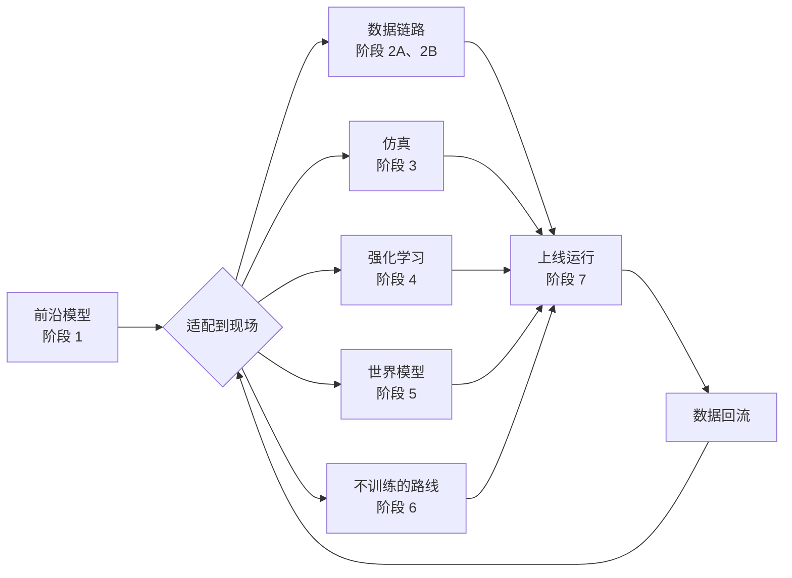
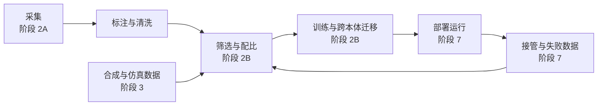

# 部署者的前沿阅读计划（约一个月）

[English](README.md) | **简体中文**

> 2026-10-08 发布快照。中文原稿在作者的私人 vault 中维护；本仓库提供可分享的中英文版本。阅读勾选和日期保留原计划状态。

Sep 24, 2026 · @Jetson Wu

2026-10-02 更新：补入 Sunday、Skild、Generalist、Dyna、Rhoda、Genesis 的前沿模型材料，以及 Dyna 的部署复盘。阶段标题日期保留原排期作参考；新增主线阅读约 12.5 小时，完成日期按文末调整。

2026-10-08 增补：阶段 4 加入 What Can RL Bring to VLA Generalization?（细读 2 小时）。本次条目与阅读建议由 Codex 生成（author: ai；owner_endorsement: unconfirmed），来源为[论文 v2](https://arxiv.org/html/2505.19789v2)及[作者项目页](https://rlvla.github.io/)，证据核查截至 2026-10-08。下方完成日期仍是粗估，本次新增约 0.4–0.5 个阅读日。

## 总览

约一个月读完：原排期 9/25 到 10/25，每天约 5 小时；10/2 增补后粗估到 10/28，详见文末。计划按部署者要做的决定来组织：拿到一个前沿模型和一个客户现场，要让它可靠地干活、越干越好，每一步有哪些路线可选。RL 是其中一条，不预设它是答案。

七条路线各占一个阶段，数据链路拆成 2A、2B 两段：前沿模型本身、数据链路、仿真、强化学习、世界模型、不训练的路线、上线后的运行时。每条都读它最强的论据和最强的反对，阶段 8 再把它们放进你手上的真实场景。

阶段 0 先定框架，阶段 8 写决策地图。每条路线都用同一组问题审：要多少数据、真机时间、算力和人力，最常在哪失败，最强的反对意见是什么。

每天节奏：一天最多一篇精读，放在最清醒的 2-3 小时；其余时间读细读、快读或写阶段产出。每两个阶段后留一个消化日（10/5、10/12、10/19），不读新论文，只补笔记、做考题。另有一条世界观专线，每天睡前读 15-20 分钟。时间不够先砍快读，不砍推导和产出。

怎么算读完：对每条路线，你都能说出它最适合的部署场景、成本量级、典型失败和最强反对；决策地图写完。

## 精读协议

三档深度的时间和产出都不一样；精读的标准是能推、能讲、能用。

| 档位 | 每篇时长 | 怎么读 | 读完要有什么 |
| --- | --- | --- | --- |
| 精读 | 4-5 小时 | 读三遍：先看摘要、图、结论，写下你预测的方法；再逐节读方法，关键公式手推一遍；最后把每个 claim 对到具体的表或图。有代码就对照核心 loss 的那几十行 | 一页笔记，并通过考题 |
| 细读 | 2-3 小时 | 方法和实验读全，不要求手推 | 能用自己的话讲清它相对前作改了什么、为什么有效 |
| 快读 | 0.5-1.5 小时 | 摘要、引言、图、结论 | 知道它的主张和适用边界 |

精读笔记固定五个格子：

1. 一句话 insight，不抄摘要
2. 核心公式，以及每一项的含义
3. 相对前作改了什么
4. 最硬和最软的各一条证据
5. 放到一个真实部署（比如连邦插拔）上怎么用，要多少数据、真机时间、算力和人力

验收：每篇精读读完，把笔记发给 Claude，按精读 RL-100 的方式出 3-5 道考题；答不上来的回到第二遍。手推卡住的地方，往往就是真正没懂的地方。

## 世界观专线

每天睡前 15-20 分钟读一篇，全程约 9.5 小时，不占阶段时间。阶段 0 已放了 Goldberg、Brooks、Sporks 和 PI 的两篇，阶段 1 有 TRI 的评测，这里是补充。

你已读的三篇锚点（a16z 的 The Physical AI Deployment Gap、Not Boring 的 Robot Steps、TechCrunch 对 RJ Scaringe 的访谈）不再排时间。下面好几篇正是它们引用或反驳的原始材料，读的时候可以对照回去。

| 完成 | 顺序 | 文章 | 配哪个阶段 | 读的时候想什么 |
| --- | --- | --- | --- | --- |
| ☑ | 1 | [The Bitter Lesson](http://www.incompleteideas.net/IncIdeas/BitterLesson.html)（Sutton，2019） | 阶段 0 | 和 Goldberg、Robot Steps 放一起：通用方法加算力在机器人里赢的前提是什么，数据从哪来 |
| ☑ | 2 | ["Data will solve robotics and automation: True or false?": A debate](https://autolab.berkeley.edu/assets/publications/media/Data-Debate-Science-Robotics-Aug-2025-scirobotics.aea7897.pdf)（Science Robotics，2025.8，Tedrake、Rus、Billard、Goldberg 等） | 阶段 0 | 学界两派各自最强的论据；你站哪边、为什么 |
| ☐ | 3 | [Debate: Will Humanoids Replace Most Human Workers?](https://www.science.org/doi/full/10.1126/scirobotics.aeh6422)（Science Robotics，2026.5，多位中外学者和从业者） | 阶段 1 | 各方对人形替代人工的节奏判断差在哪 |
| ☑ | 4 | [Elon Dreams and Bitter Lessons](https://stratechery.com/2024/elon-dreams-and-bitter-lessons/)（Ben Thompson，Stratechery，2024） | 阶段 2A | Tesla 和 Waymo 两种数据策略；"先有分发才能吃到苦涩教训"对机器人成不成立 |
| ☐ | 5 | [Learning by Watching Human Videos](https://www.skild.ai/blogs/learning-by-watching)（Skild AI） | 阶段 2A | 人类视频路线最强的公开论据；对照 Robot Steps 对它的批评看 |
| ☐ | 6 | Software 2.0（Karpathy，2017，[karpathy.medium.com](https://karpathy.medium.com)） | 阶段 2B | 数据集就是源代码时，数据链路该用什么工程纪律管：版本、调试、回归测试 |
| ☐ | 7 | [Demonstrably Safe AI for Autonomous Driving](https://waymo.com/blog/2025/12/demonstrably-safe-ai-for-autonomous-driving)（Waymo，2025.12） | 阶段 2B | 最成熟的部署数据飞轮长什么样；哪些环节能直接照搬到机器人 |
| ☐ | 8 | [Robust Autonomy Emerges from Self-Play](https://machinelearning.apple.com/research/robust-autonomy-emerges)（Apple） | 阶段 3 | 纯仿真自博弈练出的驾驶策略为什么能泛化；搬到操作任务缺什么 |
| ☐ | 9 | Understanding the World Through Action（Levine，2021） | 阶段 4 | 他为什么认为自监督加 offline RL 才是通用智能的路 |
| ☐ | 10 | The Dark Matter of Robotics: Physical Commonsense（[Generalist 博客](https://generalistai.com/blog)） | 阶段 5 | "物理常识靠规模涌现"这个判断，证据是什么 |
| ☐ | 11 | Fully autonomous robots are much closer than you think（Dwarkesh Podcast 访谈 Levine，2025.9，约 90 分钟） | 阶段 7 | 他说的自我改进飞轮具体怎么转；为什么他认为瓶颈在运营而不在算法 |
| ☐ | 12 | [Toward a General-Purpose Robotics Platform](https://a16z.com/toward-a-general-purpose-robotics-platform/)（a16z） | 阶段 8 | 平台和垂直整合之争，对 DimOS 的定位意味着什么 |
| ☑ | 13 | [The Final Offshoring](https://finaloffshoring.com/)（Jacob Rintamaki） | 阶段 8 | "把一台机器人又快又便宜地调教成做好一件事"这条路的经济账 |
| ☐ | 14 | Rodney Brooks 每年 1 月 1 日更新的 Predictions Scorecard（[rodneybrooks.com](https://rodneybrooks.com)） | 阶段 8 | 用他过去几年的预测命中率，校准你对行业节奏的判断 |
| ☐ | 15 | [The Hidden Pillar of Robotics](https://www.skild.ai/blogs/skild-crosses-100m-arr)（Skild AI 的 Deepak Pathak、Abhinav Gupta，2026.9） | 阶段 7 | 部署优先公司的世界观：节拍和准确率一样要紧；现场一直在变，所以押单视频 in-context 学习而不是反复后训练；演示文化和部署文化为什么互斥；"专才部署回流给通才"的数据飞轮。他们的线束制造项目可以直接对照连邦的线束测试。注意这是公司文章，结论拿 Sirius 和 Levine 访谈去对照 |
| ☐ | 16 | [Will Scaling Solve Robotics?](https://spectrum.ieee.org/solve-robotics)（Nishanth Kumar，IEEE Spectrum，2024） | 阶段 0 | CoRL 2023 上"规模化能不能解决机器人"之争的平衡综述：支持方（CV/NLP 的先例、苦涩教训、常识）和反对方（没数据、本体各异、99.X% 的长尾、长程误差累积、自动驾驶的前车之鉴），加上人在环和经典加学习的中间路线。可以当第 2 篇 Science Robotics 辩论的前传；读时对照 2026 年哪些担忧已被 π0.7、Dream Machines 这类结果回应，哪些还没有 |
| ☐ | 17 | [What 10 Months in Production Taught Us About the Robotics “Bubble”](https://www.dyna.co/news/robotics-bubble)（York Yang，Dyna，2026.5；快读 0.5 小时） | 阶段 0 / 7 / 8 | 现场工程如何变成下一次可复用的部署能力；公司自述交付仍需数周至数月、复用不顺，不能直接外推全行业。对照 PI 的合作伙伴模式和 Skild 的部署飞轮，检验垂直整合是否必要；阶段 8 用同类任务的部署工时、接管率与维护成本衡量进步 |

## 阶段 0（9/25）：定框架

这一阶段回答：这一行现在有哪几种主流判断，各自押的是什么？约 5 小时，全是快读。

| 完成 | 档位 | 文章 | 时长 | 读的时候盯住 |
| --- | --- | --- | --- | --- |
| ☑ | 快读 | [The Physical Intelligence Layer](https://www.pi.website/blog/partner)（PI） | 1 小时 | 部署方（Weave、Ultra）实际怎么用基础模型；他们的数据进预训练后提升多少；部署方在价值链里挣的是什么钱 |
| ☑ | 快读 | [Moravec's Paradox and the Robot Olympics](https://www.pi.website/blog/olympics)（PI） | 0.5 小时 | 微调前沿模型能把哪些难任务做下来，花了多少数据 |
| ☑ | 快读 | [Good old-fashioned engineering can close the 100,000-year data gap in robotics](https://autolab.berkeley.edu/assets/publications/media/GOFE-Can-Close-the-100000-Year-Robot-Data-Gap-Science-Robotics-Aug-2025-scirobotics.aea7390.pdf)（Goldberg，Science Robotics） | 0.5 小时 | 他列的几条缩小数据差距的路各是什么；他押的那条和部署者什么关系 |
| ☑ | 快读 | [Sporks of AGI](https://sergeylevine.substack.com/p/sporks-of-agi)（Levine） | 1 小时 | 仿真、人类视频、手持夹爪这些代理数据为什么会失效；找一条你不同意的 |
| ☐ | 快读 | [Why Today's Humanoids Won't Learn Dexterity](https://rodneybrooks.com/why-todays-humanoids-wont-learn-dexterity/)（Brooks） | 1.5 小时 | 触觉和力控那段论证；它对只靠视觉的 VLA 意味着什么 |
|  |  |  |  |  |

阶段产出（0.5 小时）：把五条适配路线（数据与模仿、仿真、强化学习、世界模型、不训练的路线）按你现在的直觉排序，每条写一句理由。阶段 8 回来对照。

## 阶段 1（9/26-9/28）：前沿模型开箱能做到哪

这一阶段回答：拿来就用的前沿模型，今天能做到哪、在哪失败？约 19 小时，原排期 3 天，新增内容需顺延。

| 完成 | 档位 | 文章 | 时长 | 读的时候盯住 |
| --- | --- | --- | --- | --- |
| ☐ | 快读 | 前沿模型路线对照：Sunday ACT-2、Skild S1、GEN-1.5、Dyna-2 / 2.1、Rhoda DVA、Genesis GENE-26.5（链接见对应阶段） | 2 小时 | 先看任务、输入、适配方式和评测边界，填统一对照表；后续按阶段读方法与实验，这里不重复细读 |
| ☐ | 细读 | [ACT-2 Preview: Generalizing Reliability](https://www.sunday.ai/blog/act-2-preview)（Sunday） | 1.5 小时 | 预训练如何缩小内部环境与陌生家庭的泛化差距；单示范实验用了 SFT，陌生家庭评测则无每户适配，分清两者；核对 99.1% 的任务范围、尝试次数、折叠质量和失败定义。关联阶段 4 |
| ☐ | 精读 | [π0.5](https://arxiv.org/abs/2504.16054)（PI，2025） | 4 小时 | "开放世界泛化"是怎么测的；多机器人数据、网页数据、高层子任务标注各贡献多少；在没见过的家里怎么失败 |
| ☐ | 细读 | [π0.7](https://www.pi.website/blog/pi07)（PI，2026.4） | 3 小时 | "可引导"具体指什么：元数据、控制模式、子目标图像；零样本跨本体到底迁移了什么；语言指导为什么能把成功率拉上去 |
| ☐ | 细读 | [Gemini Robotics 1.5](https://arxiv.org/abs/2510.03342)（Google DeepMind，2025） | 2.5 小时 | 先想再动的具身推理对长任务帮了多少；跨本体的动作迁移怎么做、效果多大 |
| ☐ | 细读 | [GR00T N1](https://arxiv.org/abs/2503.14734)（NVIDIA，2025） | 2 小时 | 真机、仿真、人类视频三类数据各占多少、各贡献什么；为什么用快慢双系统 |
| ☐ | 细读 | [A Careful Examination of Large Behavior Models for Multitask Dexterous Manipulation](https://arxiv.org/abs/2507.05331)（TRI，2025） | 2.5 小时 | 盲测和统计检验怎么做；多任务预训练在新任务上省了多少数据；哪些条件下预训练帮不上 |
| ☐ | 快读 | 星海图 [G0 技术报告](https://github.com/OpenGalaxea/G0)和 [G0.5](https://opengalaxea.github.io/G05/) | 1 小时 | 跨本体预训练在本体差距大时收益变小的实验；你负责的这家 OEM，模型边界在哪 |

阶段产出（0.5 小时）：一张表，把这几个模型放到你关心的任务上（插拔、零售价签扫描、门店作业），写清开箱能做到什么、缺什么、失败长什么样。

前沿模型统一对照表：每家记录示范或指令输入、是否更新权重、现场数据与适配耗时、测试变化范围、成功率与节拍、部署者能否实际接入。未公开的项目写未披露；公司自测、演示视频和独立验证分开记录。不同任务上的成功率不能直接排名。Skild S1 与 GEN-1.5 在阶段 6 对读；Dyna-2 和 Genesis 在阶段 2A；Rhoda 在阶段 5；Dyna-2.1 在阶段 7。

## 阶段 2A（9/29-10/1）：数据采集与规模律

这一阶段回答：靠采数据加微调，把模型适配到一个新现场，要多少数据、多少钱、多久？约 19.5 小时，原排期 3 天，新增内容需顺延。

| 完成 | 档位 | 文章 | 时长 | 读的时候盯住 |
| --- | --- | --- | --- | --- |
| ☐ | 细读 | [Dyna-2: A 1-Million-Hour Scaling Law for World-Action Models](https://www.dyna.co/dyna-2)（Dyna） | 2 小时 | 视频预测、人类动作数据与预训练规模各贡献什么；规模收益是否在后训练后的真机任务上保持；区分验证集代理指标与实际成功率。关联阶段 5 |
| ☐ | 快读 | Genesis AI / GENE-26.5：[公司发布材料](https://www.prnewswire.com/news-releases/genesis-ai-unveils-gene-26-5--the-first-ai-brain-to-enable-robots-with-human-level-physical-manipulation-capabilities-302763638.html)、[官方技术博客入口](https://www.genesis.ai/blog) | 0.5 小时 | 人手、采集手套、机器人手与仿真一起设计，减少什么数据迁移困难，又绑定什么硬件条件；关联阶段 3。2026-10-02 官网未能读取技术正文，暂以公司发布材料收录；展示能力、评测和可接入性分别记，不把宣传结论当验证结果 |
| ☐ | 精读 | [UMI](https://arxiv.org/abs/2402.10329)（Chi 等，Shuran Song 组，RSS 2024） | 4 小时 | 为什么延迟对齐、相对轨迹动作这些策略接口设计比夹爪本身更关键；不用机器人采的数据迁到机器人上，丢了什么 |
| ☐ | 精读 | [Data Scaling Laws in Imitation Learning for Robotic Manipulation](https://arxiv.org/abs/2410.18647)（Lin 等，高阳组，ICLR 2025） | 4 小时 | 泛化随环境数、物体数怎么涨；同一环境内的示范数什么时候饱和；它的高效采集策略能不能直接搬到一个新现场 |
| ☐ | 快读 | [The Curse of Precision: A Data Scaling Law for High-Precision Robotic Manipulation](https://arxiv.org/abs/2607.23108)（2026） | 1 小时 | 精度要求越高，数据需求怎么涨；拿插拔的公差去套 |
| ☐ | 精读 | [Empirical results fine-tuning π0.5 on a real manufacturing task](https://dream-machines.eu/blog/pi05-fine-tuning)（Dream Machines，2026.9） | 3.5 小时 | 整份清单里最像部署者自己笔记的一篇：在真实产线插装任务上微调 π0.5。场景多样性和数据质量为什么比数据量值钱；240 条带人工干预的试跑怎么把 1 小时数据的策略从 28% 拉到 88%；只调 RTC 推理设置为什么能从 76% 到 93%；40 次评测为什么分不出小差异；LoRA 为什么不够 |
| ☐ | 快读 | [Knowledge Insulating VLA Models](https://arxiv.org/abs/2505.23705)（PI，2025） | 1.5 小时 | 现场微调时，怎么不把模型原有的语言理解和泛化训坏 |
| ☐ | 快读 | [GEN-0](https://generalistai.com/blog/nov-04-2025-GEN-0)（Generalist 博客） | 1 小时 | 他们声称的数据规模律；数据从哪来、怎么采、一周采多少 |
| ☐ | 快读 | [In-the-Wild Compliant Manipulation with UMI-FT](https://arxiv.org/abs/2601.09988)（2026） | 0.5 小时 | 给手持采集加上力信号，对插拔这类接触任务帮多大 |
| ☐ | 快读 | [Emergence of Human to Robot Transfer in VLAs](https://www.pi.website/research/human_to_robot)（PI） | 0.5 小时 | 人类视频数据在什么规模开始有用 |

阶段产出（1 小时）：为连邦插拔写一份数据方案：用什么方式采（遥操作、UMI、人类视频），采多少、花多少钱和几天，以及为什么这么估。

## 阶段 2B（10/2-10/4）：数据链路：筛选、配比、跨本体与运营

这一阶段回答：数据从采到用，中间每一环怎么做才不浪费：哪些数据值得留、怎么配比、什么数据能跨本体、规模化采集怎么运营？约 16 小时，3 天。

阶段 2A 管采集，这一阶段管中间三环，阶段 3 补合成数据，阶段 7 管部署回流，世界模型造数据在阶段 5。

| 完成 | 档位 | 文章 | 时长 | 读的时候盯住 |
| --- | --- | --- | --- | --- |
| ☐ | 精读 | [Data Analogies Enable Efficient Cross-Embodiment Transfer](https://arxiv.org/abs/2603.06450)（Yang, Finn, Sadigh，2026） | 4 小时 | 什么样的数据才真能跨本体迁移；"数据类比"是怎么构造的；它和 DimOS 的硬件无关叙事、星海图 G0 的反面结论怎么对上 |
| ☐ | 细读 | [Open X-Embodiment](https://arxiv.org/abs/2310.08864)（2023，两人都在） | 2 小时 | 多本体混训，正迁移出在哪、负迁移出在哪；格式和动作空间怎么统一 |
| ☐ | 细读 | [DROID](https://arxiv.org/abs/2403.12945)（2024，两人都在） | 2 小时 | 十几家机构分布式采集，硬件、流程、质检、标注怎么统一；每小时有效数据的成本从哪来 |
| ☐ | 细读 | [AgiBot World Colosseo](https://arxiv.org/abs/2503.06669)（智元，2025） | 2 小时 | 数据工厂式采集怎么运营：场地、采集员、质检、标注；和 DROID 的野外分布式路线比，各自换来了什么 |
| ☐ | 细读 | [Re-Mix](https://arxiv.org/abs/2408.14037)（Hejna 等，Sadigh 组，CoRL 2024） | 1.5 小时 | 大数据集里各子集怎么配比；优化后的配比比均匀和人工配比强多少；为什么只用四分之一数据还能打平 |
| ☐ | 快读 | [Data Quality in Imitation Learning](https://arxiv.org/abs/2306.02437)（Belkhale, Cui, Sadigh，2023） | 1 小时 | 示范的"质量"到底指什么；培训采集员该盯哪几个指标 |
| ☐ | 快读 | [Robot Data Curation with Mutual Information Estimators](https://arxiv.org/abs/2502.08623)（2025） | 1 小时 | 不跑真机，怎么给每条示范打质量分 |
| ☐ | 快读 | [Curating Demonstrations using Online Experience](https://arxiv.org/abs/2503.03707)（Finn 组，RSS 2025） | 0.5 小时 | 用少量试跑结果反过来筛示范 |
| ☐ | 快读 | [Guiding Data Collection via Factored Scaling Curves](https://arxiv.org/abs/2505.07728)（2025） | 1 小时 | 下一批数据该往哪个因素（物体、场景、光照、摆放）上加 |

阶段产出（1 小时）：画一张你们自己的数据链路图（直接改上面的图也行）：每一环谁做、用什么工具、每小时有效数据的成本、哪一环最可能卡住；再写清哪些数据值得长期攒，因为它能跨本体、跨客户复用。

## 阶段 3（10/6-10/8）：仿真与 real-to-sim

这一阶段回答：仿真能替你省掉多少真机数据，差距会卡在哪？约 15 小时，3 天。

| 完成 | 档位 | 文章 | 时长 | 读的时候盯住 |
| --- | --- | --- | --- | --- |
| ☐ | 精读 | [IndustReal](https://arxiv.org/abs/2305.17110)（NVIDIA，RSS 2023） | 4 小时 | 在仿真里用 RL 学插装，迁到真机时靠哪几个算法和工程手段补差距；真机成功率怎样；给一个新零件建仿真要多少工作量 |
| ☐ | 精读 | [RialTo](https://arxiv.org/abs/2403.03949)（Torne, Gupta, Agrawal 等，RSS 2024） | 4 小时 | 从真实场景扫出数字孪生要多少人工；在孪生里用 RL 把模仿策略练鲁棒，鲁棒性提升多少；哪类场景重建不了 |
| ☐ | 细读 | [MimicGen](https://arxiv.org/abs/2310.17596)（NVIDIA，CoRL 2023） | 2 小时 | 从约 200 条人工示范扩出 5 万条，靠的是什么假设；这个假设在插拔上成不成立 |
| ☐ | 细读 | [GraspVLA](https://arxiv.org/abs/2505.03233)（银河通用、北大王鹤组，CoRL 2025） | 2 小时 | 纯合成数据预训练、直接迁到真机，效果多好；为什么先挑抓取这个任务 |
| ☐ | 快读 | [SIMPLER](https://arxiv.org/abs/2405.05941)（CoRL 2024，两人都在）和 [PolaRiS](https://arxiv.org/abs/2512.16881)（Finn 组） | 1.5 小时 | 仿真拿来做评测，是不是比拿来做训练更靠谱；仿真分数和真机分数的相关性有多高 |
| ☐ | 快读 | 回读 [Sporks of AGI](https://sergeylevine.substack.com/p/sporks-of-agi) 的仿真部分 | 0.5 小时 | 读完上面几篇，他的批评哪里站得住、哪里站不住 |

阶段产出（1 小时）：连邦插拔走仿真路线的评估：要建什么（零件模型、接触参数、相机）、多少人月、sim-to-real 最可能卡在哪；和阶段 2A 的数据方案比成本。

## 阶段 4（10/9-10/11）：强化学习

这一阶段回答：RL 在什么条件下值得上，比模仿学习多赚什么、多花什么？约 19.5 小时，按每天 5 小时约 4 天，比其他阶段略重。你偏爱 RL，所以这一阶段刻意把它的成本和它的收益放在一起读。

| 完成 | 档位 | 文章 | 时长 | 读的时候盯住 |
| --- | --- | --- | --- | --- |
| ☐ | 快读 | [Towards Universal Post-Training for Robotics](https://pd-perry.github.io/posts/post-training.html)（Perry Dong, Finn，2026.9）和配套的 [EXPO 调参笔记](https://pd-perry.github.io/posts/expo-tuning.html) | 1.5 小时 | 先读，当这一阶段的地图：机器人 RL 为什么和 LLM 的 RL 不是一回事；现有方法分成哪几类、各卡在哪；奖励、reset、人在环、调参、初始化这五个协议缺口，哪几个在你的部署里最疼 |
| ☐ | 细读 | [What Can RL Bring to VLA Generalization? An Empirical Study](https://arxiv.org/abs/2505.19789)（Liu、Gao 等，清华，NeurIPS 2025；[项目页](https://rlvla.github.io/)） | 2 小时 | 把泛化拆成视觉、语义、执行三类：为什么 RL 对执行提升最明显、语义有一定提升、视觉与 SFT 接近；重点读第 5 节和失败恢复案例，再看 PPO 与 GRPO/DPO 的对照。核对 OpenVLA、仿真抓放、规划器示范的证据边界，以及交互量与 SFT 数据覆盖是否可比；这些结果能否迁到真机插装，仍需验证 |
| ☐ | 精读 | [HIL-SERL](https://arxiv.org/abs/2410.21845)（Luo, Xu, Wu, Levine） | 4 小时 | 训练时间、reset、奖励分类器、人工干预，这几样部署成本各多少；成功率和节拍比模仿学习多赚了什么 |
| ☐ | 精读 | [RL Token: Bootstrapping Online RL with Vision-Language-Action Models](https://arxiv.org/abs/2604.23073)（Charles Xu、Jost Tobias Springenberg 等，含 Sergey Levine，2026.4） | 4 小时 | RL token 如何保留 VLA 的任务知识，让小型 actor-critic 高效做在线 RL；策略如何约束在 VLA 附近，为什么不在线重训整个 VLA；螺丝安装、扎带紧固、充电器与网线插入的成功率和节拍分别提升多少，最难子阶段的提速能否代表完整任务；真机交互、reset、奖励与人工投入各花多少，对照 HIL-SERL 和 EXPO-FT 的成本结构 |
| ☐ | 细读 | [EXPO-FT](https://arxiv.org/abs/2605.25477)（Dong, Hung, Gao, Sadigh, Finn，CoRL 2026） | 2 小时 | 大模型出候选、小 edit policy 修正、Q 值挑最优、再把选中的动作吸收回大模型，这套结构的稳定性从哪来；十几分钟在线交互之外，训练算力要多少；和 RLT 逐项对照 |
| ☐ | 细读 | [π\*0.6 / RECAP](https://arxiv.org/abs/2511.14759)（PI，2025） | 3 小时 | 大规模 RL 用在真实任务上，成功率和吞吐提升多少；需要多少部署数据和人工纠正 |
| ☐ | 细读 | [When Should We Prefer Offline RL Over Behavioral Cloning?](https://arxiv.org/abs/2204.05618)（Kumar 等，Levine，ICLR 2022） | 2 小时 | 什么数据和任务条件下 RL 才赢模仿学习；把你的几个场景代进去 |
| ☐ | 选读 | [RL-100](https://arxiv.org/abs/2510.14830)（许华哲组） | 3 小时 | 你已读到一半；读完正好和 HIL-SERL、RLT 对照成本结构 |

阶段产出（1 小时）：一页"RL 什么时候值得上"：任务特征、数据条件、成本门槛；再对照阶段 2A、3，写清它赢在哪、输在哪。

## 阶段 5（10/13-10/15）：世界模型

这一阶段回答：世界模型现在能替部署者做什么：评测、造数据，还是直接当策略？约 15.5 小时，原排期 3 天。

| 完成 | 档位 | 文章 | 时长 | 读的时候盯住 |
| --- | --- | --- | --- | --- |
| ☐ | 快读 | [Causal Video Models Are Data-Efficient Robot Policy Learners](https://www.rhoda.ai/research/direct-video-action)（Rhoda，DVA） | 0.5 小时 | 视频预测怎样通过逆动力学转成动作；长历史解决什么状态歧义；机器人数据需求与客户 POC 的边界 |
| ☐ | 细读 | [Does Scaling Web-Video Pre-training Help Real Robots Do Real Work?](https://www.rhoda.ai/research/scaling-web-video-pretraining)（Rhoda，2026.9） | 2 小时 | 普通网络视频预训练如何影响工业拆包任务；控制了哪些变量，完成率和节拍怎样合并评分；阅读评测协议，区分一个任务上的规模证据与跨任务泛化。与 Dyna-2 的数据来源、动作标签和真机评测对照 |
| ☐ | 精读 | [Ctrl-World](https://arxiv.org/abs/2510.10125)（Guo, Shi, Chen, Finn，ICLR 2026） | 4 小时 | 在世界模型里评估策略，和真机评估的一致性有多高；用想象出的轨迹改进策略，提升从哪来、会被什么骗 |
| ☐ | 细读 | [Cosmos 3](https://arxiv.org/abs/2606.02800)（NVIDIA，2026） | 3 小时 | 一个模型同时做理解、视频生成、世界模拟和出动作，各项到底多成熟；它当策略用是怎么做的 |
| ☐ | 细读 | [V-JEPA 2](https://arxiv.org/abs/2506.09985)（Meta，2025） | 3 小时 | 不生成像素的世界模型怎么直接用来规划动作；只用几十小时无标注机器人视频后训练，零样本能做到什么、做不到什么 |
| ☐ | 快读 | [VLAW](https://arxiv.org/abs/2602.12063)（Finn 组，ICML 2026） | 1 小时 | 策略和世界模型互相喂数据、交替变强，这个闭环在哪会崩 |
| ☐ | 快读 | Going Beyond World Models & VLAs（[Generalist 博客](https://generalistai.com/blog)） | 1 小时 | 他们为什么认为 VLA 和世界模型都不是终点，理由站不站得住 |

阶段产出（1 小时）：给世界模型在部署里的三种用法（评测、造数据、当策略或模拟器）排序，每种写清现在的成熟度和证据，以及你会先在哪个场景试。

## 阶段 6（10/16-10/18）：不训练的路线

这一阶段回答：不训练或只少量训练，靠教、提示、分层和传统工程，能走多远？约 17 小时，原排期 3 天，新增内容需顺延。

| 完成 | 档位 | 文章 | 时长 | 读的时候盯住 |
| --- | --- | --- | --- | --- |
| ☐ | 细读 | [Introducing S1: In-Context Learning for Robotics](https://www.skild.ai/blogs/s1)（Skild）与 [GEN-1.5: Embodied Foundation Models are One-Shot Learners](https://generalistai.com/blog/gen-1.5)（Generalist） | 2 小时 | 成对读：prompt 是视频还是包含动作的感知运动序列；是否更新权重；新任务定义、时长和训练覆盖怎样交代。GEN-1.5 分开报告上下文学习与少量微调，不能混用成功率；与 ACT-2 单示范 SFT 对照，判断何时 prompt 足够、何时还要后训练 |
| ☐ | 精读 | [Instant Policy](https://arxiv.org/abs/2411.12633)（Vosylius, Johns，ICLR 2025） | 4 小时 | 给一两条示范就当场执行新任务、不更新权重，靠的是什么样的预训练；适用任务的边界在哪 |
| ☐ | 细读 | [Hi Robot](https://arxiv.org/abs/2502.19417)（PI，ICML 2025，两人都在） | 2.5 小时 | 人在现场的实时插话，怎么变成低层能执行的子任务；这一层对部署现场值多少 |
| ☐ | 细读 | [OK-Robot](https://arxiv.org/abs/2401.12202)（Lerrel Pinto 组，RSS 2024） | 2.5 小时 | 把现成模型拼成系统，失败主要出在哪一环；为什么它的结论是细节决定成败 |
| ☐ | 细读 | [Integrated Task and Motion Planning](https://arxiv.org/abs/2010.01083)（Garrett, Kaelbling, Lozano-Pérez 等，2021） | 2.5 小时 | 传统规划在什么条件下比学习方法更可靠、更便宜；它最怕什么 |
| ☐ | 快读 | [Code as Policies](https://arxiv.org/abs/2209.07753)（Liang, Zeng, Florence 等，2023） | 1 小时 | 让 LLM 写控制代码，适合哪类任务、在哪崩 |
| ☐ | 快读 | [Inner Monologue](https://arxiv.org/abs/2207.05608)（2022，Levine 在作者里）和 [Yell At Your Robot](https://arxiv.org/abs/2403.12910)（RSS 2024，两人都在） | 1.5 小时 | 闭环语言反馈和语言纠正，哪些能直接搬到现场 |

阶段产出（1 小时）：连邦插拔的"不训练"方案能走多远：状态机加 VLM 监控加分段策略，哪一段必须学、哪一段靠工程就够；再和阶段 4 的 RL 方案比成本。

## 阶段 7（10/20-10/23）：上线之后

这一阶段回答：上线之后，怎么判断它在正常干活、出错谁来接、数据怎么回流让它越干越好？约 21.5 小时，原排期 4 天，新增内容需顺延。

| 完成 | 档位 | 文章 | 时长 | 读的时候盯住 |
| --- | --- | --- | --- | --- |
| ☐ | 细读 | [Dyna-2.1: A Physical Agent for End-to-End Workflows](https://www.dyna.co/dyna-2.1)（Dyna） | 2 小时 | 控制、动作策略与上层工作流编排如何分工；记忆、条件分支和异常恢复由哪层处理；一小时完整演示能证明什么，还缺什么长期运行指标。和 Dyna 的 robotics-bubble 复盘对照，看哪些部署瓶颈有了回应，哪些仍未验证 |
| ☐ | 精读 | [Robot Learning on the Job（Sirius）](https://arxiv.org/abs/2211.08416)（Liu 等，Yuke Zhu 组，RSS 2023） | 4 小时 | 部署中人工接管的数据怎么回流训练；接管率怎么随时间下降；它为什么把这比作软件的 CI/CD |
| ☐ | 细读 | [Real-Time Execution of Action Chunking Flow Policies（RTC）](https://arxiv.org/abs/2506.07339)（Black, Galliker, Levine，NeurIPS 2025） | 2.5 小时 | 推理延迟在现场怎么变成停顿、抖动和失败；不用重训的异步执行怎么解决它 |
| ☐ | 细读 | [RoboReward](https://arxiv.org/abs/2601.00675)（2026，两人都在） | 2 小时 | 通用奖励和验证模型在哪些情况会误判；能不能直接当现场的成功检测 |
| ☐ | 细读 | [AutoRT](https://arxiv.org/abs/2401.12963)（Google DeepMind，2024，两人都在） | 2.5 小时 | 一个人管 3 到 5 台机器人要满足什么前提；基础模型当调度员时，安全规则怎么写 |
| ☐ | 细读 | [Autonomous Improvement of Instruction Following Skills via Foundation Models（SOAR）](https://arxiv.org/abs/2407.20635)（Levine 组，CoRL 2024） | 2 小时 | 基础模型出任务、机器人自己练、自动打分，这个闭环在新环境里能提升多少、还要不要人 |
| ☐ | 细读 | [RoboArena](https://arxiv.org/abs/2506.18123)（CoRL 2025，两人都在） | 2 小时 | 多地分布式真机评测怎么做到可比；对 Robot Town 做评测设施有什么启发 |
| ☐ | 快读 | [So You Think You Can Scale Up Autonomous Robot Data Collection?](https://arxiv.org/abs/2411.01813)（Sadigh 组，2024） | 1 小时 | 自主采数据的隐性人力成本到底多大 |
| ☐ | 快读 | [Scaling Verification Can Be More Effective than Scaling Policy Learning for VLA Alignment](https://arxiv.org/abs/2602.12281)（Finn 组，ECCV 2026） | 1 小时 | 把算力花在验证而不是策略上，什么时候更划算 |
| ☐ | 快读 | 回读 [The Physical Intelligence Layer](https://www.pi.website/blog/partner) 里 Ultra 那段 | 0.5 小时 | 人在环干预系统在真实仓库里怎么和数据飞轮接上 |

阶段产出（2 小时）：一份部署运行时清单，写清评测怎么做、成功怎么判、延迟怎么扛、人在哪接管、数据怎么回流；再标出 DimOS runtime 现在缺哪几块。

## 阶段 8（10/24-10/25）：决策地图

这一阶段回答：把五条适配路线放进你手上的真实场景，各该先上哪条？约 10 小时，2 天，以写为主。

1. 回读 Goldberg 社论和 The Physical Intelligence Layer（1 小时）
2. 填下面这张表（6 小时）：每一格都要能指回前面某个阶段的论文或产出
3. 回看阶段 0 的直觉排序（1 小时）：改了哪条、为什么
4. 写一段"RL 在我的部署里的位置"（2 小时）：主线、补最后一段，还是暂时不用

| 场景 | 首选路线 | 备选路线 | 数据、时间、钱 | 最大风险 | RL 的位置 |
| --- | --- | --- | --- | --- | --- |
| 连邦插拔 |  |  |  |  |  |
| 零售价签扫描 |  |  |  |  |  |
| 门店作业 |  |  |  |  |  |
| Robot Town 评测 |  |  |  |  |  |

## 快慢怎么调

原计划主线约 159 小时；2026-10-02 新增约 12.5 小时后，主线约 171.5 小时；2026-10-08 再增补本篇 2 小时，主线约 173.5 小时，含原有 3 个消化日，世界观专线约 9.5 小时另计。以下是在原预计完成日期上增加阅读量的粗估，不代表已完成进度；阶段标题日期是原排期参考，实际按阅读顺序顺延。

| 每天投入 | 大约读完 | 怎么调 |
| --- | --- | --- |
| 6 小时 | 约 10/23 | 比原估计增加约 2–3 天，不再追加阅读量 |
| 5 小时 | 约 10/28 | 比原估计增加约 3 天，阶段日期顺延 |
| 4 小时 | 约 11/6 | 比原估计增加约 3–4 天；先压缩快读，不砍消化日 |

再往前压，就只能跳过推导、阶段产出和消化日，那就是 surface level 了。广度计划的深度，来自每条路线都被同一组问题审过一遍，不来自读过的篇数。

10/12 的消化日是检查点：前四条路线里还有哪条你说不清它的成本和失败方式，就放慢，不要硬追。

## 按需查阅

阶段 4 读完，如果你判断 RL 值得押，就从前三行接着深挖；其余碰到对应的事再翻，按快读或细读处理就够。

| 什么时候翻 | 读什么 |
| --- | --- |
| RL 深挖：off-policy 与真机系统 | [SAC](https://arxiv.org/abs/1812.05905)；[RLPD](https://arxiv.org/abs/2302.02948)；[SERL](https://arxiv.org/abs/2401.16013)；[RLinf-USER](https://arxiv.org/abs/2602.07837)；[Real-Time EXPO-FT](https://arxiv.org/abs/2609.18207) |
| RL 深挖：advantage 与 offline | [AWR](https://arxiv.org/abs/1910.00177)；[AWAC](https://arxiv.org/abs/2006.09359)；[CFGRL](https://arxiv.org/abs/2505.23458)；[IQL](https://arxiv.org/abs/2110.06169)；[CQL](https://arxiv.org/abs/2006.04779)；[What Matters for Batch Online RL in Robotics?](https://arxiv.org/abs/2505.08078)；[A Workflow for Offline Model-Free Robotic RL](https://arxiv.org/abs/2109.10813) |
| RL 深挖：VLA 后训练 | [Posterior BC](https://arxiv.org/abs/2512.16911)；[Q-chunking](https://arxiv.org/abs/2507.07969)；[EXPO](https://arxiv.org/abs/2507.07986)；[DSRL](https://arxiv.org/abs/2506.15799)；[V-GPS](https://arxiv.org/abs/2410.13816)；[Cal-QL](https://arxiv.org/abs/2303.05479)；[WSRL](https://arxiv.org/abs/2412.07762)；[Q-Learning with Adjoint Matching](https://arxiv.org/abs/2601.14234)；[Residual Off-Policy RL](https://arxiv.org/abs/2509.19301)；[Beyond Action Residuals](https://arxiv.org/abs/2605.19919)；Diffusion-QL、IDQL、Flow Q-Learning（Perry Dong 那篇里几类方法的代表作） |
| 连邦要换型号、跑多 SKU | Offline Meta-RL for Industrial Insertion（Levine）；Multistage Cable Routing Through Hierarchical Imitation Learning（Levine）；AutoMate（NVIDIA，多几何装配）；[SpeedTuning](https://ieeexplore.ieee.org/document/11128753/)（Finn） |
| 数据深挖 | [RoboCrowd](https://arxiv.org/abs/2411.01915)；[TacUMI](https://arxiv.org/abs/2601.14550)；[DataMIL](https://arxiv.org/abs/2505.09603)；[Ambient Diffusion Policy](https://arxiv.org/abs/2606.12365)（从次优数据里学）；[Is Diversity All You Need for Scalable Robotic Manipulation?](https://arxiv.org/abs/2507.06219)；[Human-in-the-Loop Data Collection](https://aurelarnold.xyz/blog/human-in-the-loop-data-collection/)（Arnold）；[Unfolding Robotics](https://huggingface.co/spaces/lerobot/robot-folding)（Hugging Face） |
| 前沿模型补课 | [π0](https://arxiv.org/abs/2410.24164)；FAST；[OpenVLA](https://arxiv.org/abs/2406.09246)；[OpenVLA-OFT](https://arxiv.org/abs/2502.19645)；[MEM](https://arxiv.org/abs/2603.03596)；[Training-Time Action Conditioning for Efficient Real-Time Chunking](https://arxiv.org/abs/2512.05964) |
| 教与少样本 | [Behavior Retrieval](https://arxiv.org/abs/2304.08742)；[Freeform Preference Learning](https://arxiv.org/abs/2606.32027)；ICRT（Goldberg 组）；[Keypoint Action Tokens](https://arxiv.org/abs/2403.19578)（Johns 组） |
| 运行时与评测 | [PolaRiS](https://arxiv.org/abs/2512.16881)；AutoEval（Levine）；REFLECT（Shuran Song）；[Robot Utility Models](https://arxiv.org/abs/2409.05865)（Lerrel Pinto） |
| 跨本体与导航 | GNM、ViNT、NoMaD、CrossFormer（Levine 组）；[Pushing the Limits of Cross-Embodiment Learning](https://arxiv.org/abs/2402.19432)；[Data Analogies](https://arxiv.org/abs/2603.06450)；[CHORUS](https://arxiv.org/abs/2606.12352)；[Mobility VLA](https://arxiv.org/abs/2407.07775) |
| 世界模型往下走 | RLinf 的 WoVR；DreamGen（NVIDIA） |
| 世界观 | [How to Train Your Robot with Deep RL: Lessons We've Learned](https://arxiv.org/abs/2102.02915)；其余见世界观专线 |
